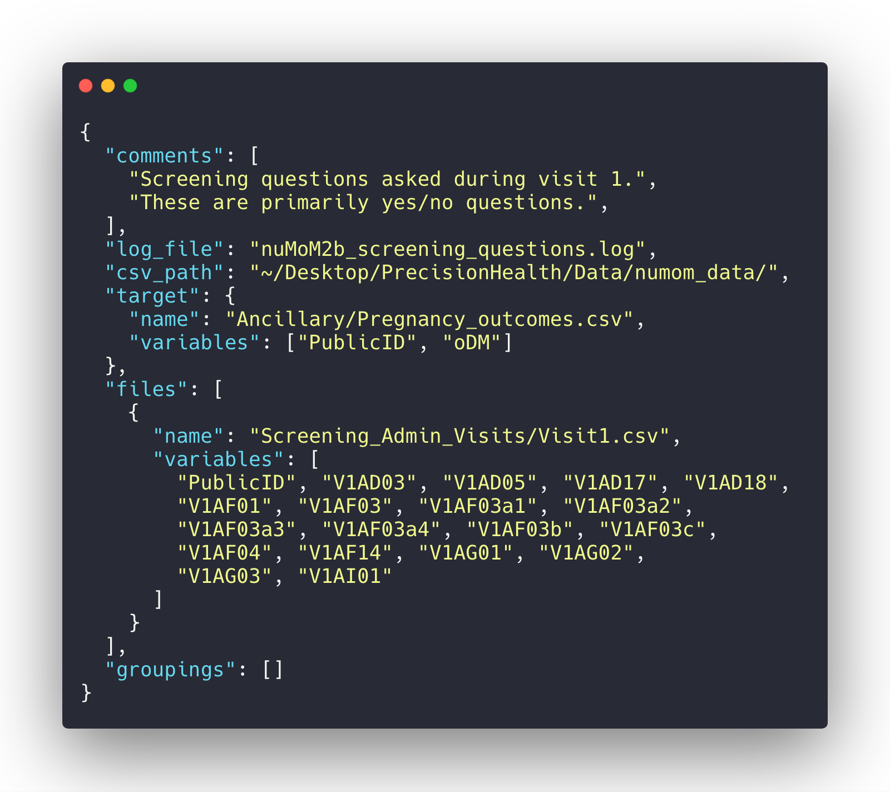
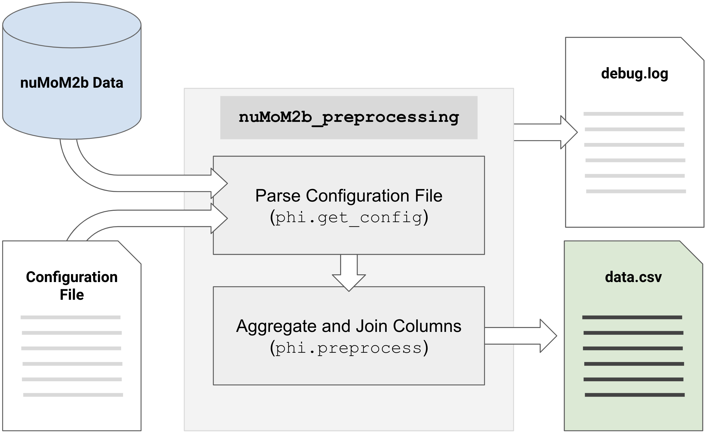

=====================
nuMoM2b_preprocessing
=====================

A Python package for pre-processing ``nuMoM2b`` data with configuration files.

.. image:: https://readthedocs.org/projects/numom2b-preprocessing/badge/?version=latest
   :target: https://doc.numom2b.org/en/latest/?badge=latest
   :alt: Documentation Status
.. image:: https://travis-ci.com/hayesall/nuMoM2b_preprocessing.svg?branch=master
   :target: https://travis-ci.com/hayesall/nuMoM2b_preprocessing
   :alt: Build Status
.. image:: https://codecov.io/gh/hayesall/nuMoM2b_preprocessing/branch/master/graph/badge.svg
   :target: https://codecov.io/gh/hayesall/nuMoM2b_preprocessing
   :alt: Code Coverage

This is one component within a wider research project for predicting adverse events
over the course of a woman's pregnancy. This package serves the dual role of assisting
with pre-processing tasks and for producing reproducible partitions of the data based
on configuration files.

.. toctree::
   :maxdepth: 1
   :hidden:
   :caption: Getting Started:

   getting_started
   architecture
   first_config

.. toctree::
   :maxdepth: 1
   :hidden:
   :caption: API:

   api/numom2b_preprocessing
   api/numom2b_preprocessing.get_config
   api/numom2b_preprocessing.preprocess

.. toctree::
   :glob:
   :maxdepth: 1
   :hidden:
   :caption: Sample Config Files:

   config_files/*

.. toctree::
  :hidden:
  :caption: External Links

  GitHub Repository <https://github.com/hayesall/nuMoM2b_preprocessing>
  Bug Tracker <https://github.com/hayesall/nuMoM2b_preprocessing/issues>

Maintained by `Alexander L. Hayes <https://hayesall.com>`_, a Ph.D. student with the
`Indiana University ProHealth Group <https://prohealth.sice.indiana.edu>`_
working on the Precision Health Initiative (φ). Alexander can be reached at
`hayesall@iu.edu <mailto:hayesall@iu.edu>`_.

`Getting Started <getting_started.html>`_
-----------------------------------------

Pointers for getting nuMoM2b_preprocessing working on your local machine.

`Architecture <architecture.html>`_
-----------------------------------

High-level overview of how this project is organized.

`Writing Configuration Files <first_config.html>`_
--------------------------------------------------

Configuration files define which variables should be used and how they should be
aggregated. This is a worked example for writing a configuration file.

.. code-block:: json

    {
      "csv_path": "../FullData/numom_data/",
      "target": {
          "name": "Ancillary/Pregnancy_outcomes.csv",
          "variables": ["PublicID", "oDM"]
      },
      "files": [
        {
          "name": "Screening_Admin_Visits/Visit1.csv",
          "variables": ["PublicID", "V1BA01_KG", "V1BA01_LB"]
        }
      ]
    }

Indices and tables
==================

* :ref:`genindex`
* :ref:`modindex`
* :ref:`search`
